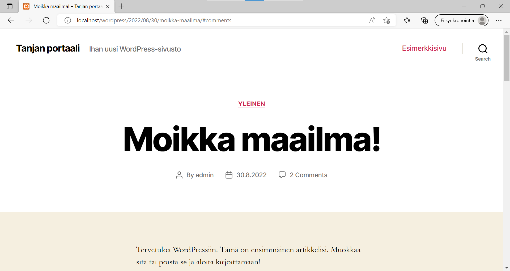

# Harjoitus 1 dokumentointi

## T1 päivitetty xamppin localhost

3/3

## T2 mysql toiminta

Mysql:n pääkäyttäjän tunnus on oletusarvoisesti root ja salasana tyhjä
3/3

## T3 ja T4  WP:n toiminta, näkymien järjestely 

admin-puoli pyörii chromessa

tavispuoli edgellä (huom. teema)
3/3 + 1/1 

## T5 kommentointi

1/1

## T6 teeman vaihto
ks T3 ja T4 kuva tavispuolesta, siinä näkyy
1/1

## T7 värien muokkaus

Onnistuu, valitsee värivalikosta värit (linkkien värit "Primary Color" vaihdetaan Customiksi ja valitaan väri). Tämän jälkeen pitää muistaa painaa ylhäältä Publish.
1/1

## T8 uusi sivu

Sivun löytää etsi-toiminnolla (tai kirjoittamalla sivun nimen osoitekenttään localhostin perään)
2/2

## T9 uusi menu

Hyvin näkyy, lisäsin sen footerin menuun ja päämenuun.
2/2

## T10 menun asetukset

Siinäpä näkyy
1/1

## T11 Footer Widget

siellä lepää

poistettu todistetusti
2/2

## T12 CSS kustomointi

1/1

## T13 lisää teemoja
Material designillä footer widgetiin alunperin lisätty meny siirtyy sidebar widgetiin. Footer widget tulee erikseen vielä alle (kun sen käy lisäämässä "päälle"). Jos footer widgetiä ei ole päällä, se ei näy lainkaan.

Bootstrap Fastilla ei myöskän footeriin tule menua automaattisesti. Mutta näkyy kun sen laittaa päälle

Bootstrap Starterilla footer menua ei saa näkyviin, vaikka se olisi päällä muissa teemoissa. (Koko footer on näkymätön)

Top Top Menu näkyy kaikissa.
1/1

## T14 
/3

## T15
tehty opettajan ohjeistuksen mukaan videolta seuraten.

5/5

## T16
Sain tehtyä XAMPista varmuuskopion MyPhp:n kautta:

VLE:n varmuuskopion tein wordpressohjeiden mukaan ja lopulta zippasin koko kansion html-kansioon: 

Tämä vaati vähän tutustumista, sillä suoraan wordpressin ohjeilla en saanut tehtyä. mutta lopulta onnistui, se tärkeintä :)
5/5

