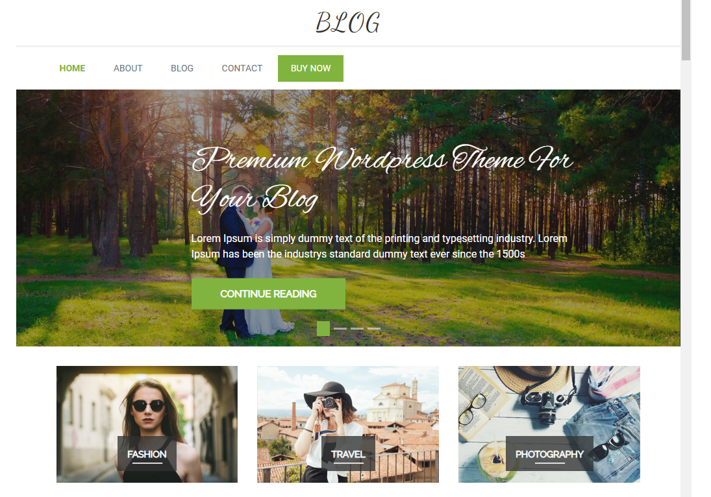

# Dokumentaatio harkkatyöstä

Studio Rumian verkkosivut (blogi/verkkokauppa)
Tanja Korolainen, AB3775, TTV21SM
Web-julkaisujärjestelmät syksy 2022
Palautettu 17.11.2022

Linkki sivustolle: http://172.21.4.76/rumia/

Ei mitään kokemusta php-ohjelmoinnista entuudestaan. Javascriptiä olen vähän pyöritellyt, samoin html on tuttua, css:stä perusteet. Bootstrap oli onneksi entuudestaan tuttu, joten sen muotoiluja oli suht helppo muuttaa, kun löysi php-koodin seasta oikeat kohdat.

## Taustaa

Sivusto on suunnattu työssäkäyville ja työelämässä hieman pidempään olleille naisille, jotka ovat ikähaarukassa 25-45 vuotta. Naisille, joiden arvomaailmaan kuuluu ekologisuus, luonto, DIY-meininki ja jotka arvostavat taidetta/kulttuuria ja haluavat tukea suomalaisia pienyrittäjiä laadukasta ja kaunista ulkoasua. 

Sivuston tarkoitus on toimia väylänä myydä Studio Rumian palveluita ja tuotteita (käsityöt ja valokuvauspalvelut),blogi toimii ohjeiden ja muiden kuulumisten jakelualustajana, johon tuotetaan ilmaisia käsityö-, kokkaus ja leivontaohjeita ja samalla päästää sivustolla vierailevat ihmiset tutustumaan syvemmin yrittäjään ja siten kiinnostumaan ostamaan palveluita. Tavoitteena on saada myytyä tuotteita ja valokuvauspalveluita.

## Testaus
Sivusto toimii Google Chromella, Firefoxilla ja Edgellä työpöytä versiona. Kaikki linkit ja toiminnat on testattu kaikilla näillä selaimilla toimivaksi.

Chrome, adminnäkymä

Edge, tavisnäkymä

Firefox, tavisnäkymä:

Testattu Developer Toolsin avulla padi ja mobile-näkymää, mutta oikeita laitteita ei ikävä ollut testaukseen (en saanut labranetin vpn:ä puhelimeen), joten todellista toimintaa en sen suhteen voi luvata.

## Oma arvio

Oma numeerinen arvio työstä: 3.5

Mielestäni onnistuin käyttämään hyvin monipuolisesti käyttöliittymän perustoimintoja ja muokkaamaan perusnäkymiä luovasti sen kautta. Oma posttyyppi teetti eniten töitä ja mielestäni siitä tuli aika hyvä ottaen huomioon, että minulla ei ollut mitään taustatietoa php-ohjelmoinnista entuudestaan. Käytin myös lisäosia monipuolisesti ja Woocommercea lukuunottamatta käytin eri lisäosia kuin kurssin harjoitusten aikana. Pyrin tekemään ratkaisuja ja muokkauksia myös eri tavoin kuin harjoitteissa ja mielestäni onnistuin siinä. Erityisen ylpeä olen siitä miten pystyin luomaan pelkillä widgeteillä hyvinkin näyttävän ja toiminnallisen etusivun. Kaikenkaikkiaan kokonaisuus on mielestäni hyvä. Se on toimiva ja näyttävä.

Kehittämistä on mielestäni ulkomuodossa (kontrasti erityisesti ei mene läpi esteettömyyden testauksesta). Php-koodista olisi voinut pyrkiä tekemään selkeämmän (jätin aika paljon vanhaa koodia tiedostoihin, enkä poistanut esim. if-else-rakenteita kuin yhdestä tiedostosta ja sieltäki vain osittain). Tässä olisi kehittämisen paikka, sillä if-else rakenteet ovat tiedostoissa sen vuoksi, että teema on vahvasti muokattavissa käyttöliittymän kautta. Tässä tapauksessa tämä kyseinen näkymä ja asettelu toimi vain juuri niillä asetuksilla, jotka olen käyttöliittymän kautta asettanut. Sidebarin puolta tai palstojen määrää muutettaessa tekemäni muutokset php-koodissa "katoavat", sillä en tehnyt muutoksia kuin tiettyihin vaiheisiin if-lausetta. Tässä tuli vastaan oma php-osaamisena ja tyydyin siihen, että sain muutokset näkyviin haluamallani tavalla.

Tietoturvaa ei juurikaan ole toteutuksessani otettu huomioon lomakkeen recaptcha osiota lukuunottamatta. Tässä olisi ehdoton kehittämisen paikka, erityisesti, koska mukana on verkkokauppa. Hakukoneoptimointia ei ole otettu huomioon (muuten kuin asetuksissa jätetty "optimointi" päälle). 

Lopputulos on itseasiassa parempi kuin odotin alunperin. Poikkesin hiukan alkuperäisestä suunnitelmasta, sillä alunperin minun ei ollut tarkoitus luoda esittely-sivulle archive näkymää ollenkaan. Tulin kuitenkin sivustoa tehdessä tulokseen, että archive näkymä olisi parempi oppimisen kannalta, mutta olisi järkevä tapa koota yrityksen hahmot samalle sivulle. Alunperin oluin myös suunnitellut sivuston etusivun olevan blogi-sivu, mutta visuaalisista syistä halusin lopulta etusivusta staattisen. Samalla se antoi minulle mahdollisuuden osoittaa vielä kykeneväni tekemään näyttäviä ratkaisuja pelkällä käyttöliittymällä ja widgeteillä.

## Tekniikkaa

Sivusto on rakennettu pääosin WordPressin käyttöliittymää, plugineja sekä widgetejä käyttäen. Oma Post-tyyppi (Esittely-sivu) on luotu itse ilman lisäosia. Teemana on käytetty Multipurpose-Blog-teemasta tehtyä lapsiteemaa (Multipurpose-Child).

Alkuperäinen teema:

Tekemäni lapsiteema:

### Teema ja itseluodut php-tiedostot

Teeman kansioon (tiedostot löytyvät githubista) on luotu itse-tehdyt tiedostot, joiden pohjana on käytetty teeman omia vastaavia templateja.
- archive-esittely-php (esittely-sivu -> Esittely-postin archive-sivu)
- galleria-page.php (single.php:sta *hyvin kevyesti* muokattu staattinen sivu gallerialle)
- sidebar-esittely.php (Esittely-posteille oma sidebar (*HUOM! näkyvissä vain single-esittelyissä, ei archivessa, koska halusin sivulle kuitenkin yhtenäistä ilmettä*))
- sidebar-kauppa.php (verkkokaupan oma sidebar, johon halusin tuotteita ja tuote-etsintä widgetin)
- single-esittely.php (Esittely-postin single-sivun näkymä)
- style.css (pakollinen tiedosto lapsiteemassa, vain pakolliset tiedot, muutoksia ei ole tehty, kaikki css-muotoilut on tehty inlinenä, koska niitä tuli lopulta aika vähän)
- oma-plugin.php (Esittely-sivun (oma posttyyppi) plugin)

Lisäosina on käytetty:
- WooCommerce- verkkokauppaa
- Photo Gallery -gallerialle
- Forminator -yhteydenottokaavakkeelle

#### Etusivu ja yleinen ilme

Etusivu on muokattu kokonaan käyttöliittymän puolella. Aluksi vaihdoin teeman asetuksista etusivulle staattisen sivun (blogi-sivu toimii archivenäkymänä posteille). Cover-kuva toimii katseenvangitsijana ja sen alla oleva "valikko" ohjaa käyttäjän haluamansa blogikategorian archive-sivulle. Tämä on toteutettu myös widgeteillä: 
1) Loin 3 palstaa
2) Lisäsin jokaiselle palstalle oman coverin (ensin väri, tämän jälkeen vielä kuva päälle ja muokkasin värin overlayta)
3) Lisäsin jokaiseen coveriin napin, jota muokkasin hiukan oletusasetuksista. Lopulta lisäsin nappiin tietysti oikeat linkit.

Yleistä ilmettä ajatellen lisäsin sivulle käyttöliittymän kautta vielä taustakuvan, jotta sain eloa ilmeeseen.

Menu on luotu käyttiksen puolella kokonaan. Eli värit yms on muokattu sitä kautta. Footer on myös rakennettu kokonaan käyttöliittymän puolella. Vaihdoin aluksi footerin 3 osaiseksi: 1. osa somenapeille, 2. osa somenappien viitetekstille ja 3. osa kuvien copyright tiedoille. 

Yksi huomionarvoinen juttu on se, että tein käyttöliittymästä muutoksen tyylitiedostoon -> loin meadia queryn alle 500px näytöille ja muutin taustavärin tummanharmaaksi, jotta mobiilissa lomakkeen valkoinen teksti näkyisi paremmin.

#### Oma Posttyyppi:
Esittely- sivu, joka on tehty sivustokohtainen pluginin avulla *plugin tehty siis itse, ei käytetty lisäosaa tähän, koodi löytyy oma-plugin-php nimellä*.  

##### Single-esittely
Halusin Esittely-sivujen olevan tyyliltään lähellä muuta sivustoa, joten en halunnut tehdä post-tyypistä liian erilaista. Lähinnä muokkasin sidebaria, sekä sivulle tulevia tietoja.

Erillisiä sidebareja varten muokkasin functions.php tiedostossa valmiiksi reksiteröityjä sidebarien nimiä: sidebar-2-> esittely ja sidebar-3->kauppa. Näin sidebarit olisi helpompi tunnistaa sekä käyttiksessä, että koodissa.

Custom Fieldseissä käytin metatietoja, eli en käyttänyt tässäkään lisäosaa, vaan naputtelin haluamani custom fieldsit käyttöliittymässä  

ja näytin ne the_meta() funktiolla single-esitys.php:ssä. 

Muita muutoksia jouduin tekemään luokkiin (bootstrap-luokat), jotta sain sidebarista haluamani kokoisen ja itse sisällöstä suuremman. Lisäsin myös sivun alareunaan postien välisen navigaation previous_post_link() ja next_post_link() tageilla.Sidebarin sisällön ja ulkomuodon määrittelin käyttiksen kautta widgeteillä.

##### Archive-esittely

Tämä sivu olisi ollut nätti sellaisenaankin (eli archive.php:n asetuksilla), mutta halusin muokata myös archice-näkymää itse. Periaatteessa ulkoasu ei ihan kamalasti muuttunut muuten kuin kuvat pienenivät ja grid-muotoilu(korttityyli) poistui.

Tyylimuutokset tein inline-css:nä, eli vaihdoin tekstin keskityksen keskelle vasemman sijaan ja muokkasin hieman marginaaleja.

#### Galleria-sivun template

Muutin galleria sivun templaattia todella minimaalisesti, sillä ainoa muutos mitä halusin, oli saada sivun otsikko pois sivulta, jotta käyttöliittymän puolella rakentamani "otsikkonäkymä" (cover-widgettiä hyödyntäen) olisi ainoa otsikko sivulla. Käytännössä ainoa muutos oli, että poistin title näyttävän tagin sivulta. Galleria sivu on muuten rakennettu käyttiksen kautta hyödyntäen widgetejä ja Photo Gallery-lisäosaa, jonka valitsin lautauskertojen ja ilmaisen version sisällön perusteella. (Gallerian kaikki kuvat omiani)

#### Verkkokauppa

Kauppa on toteutettu WooCommercea hyödyntäen. Tuotteet on tuotu generaattorila generoidun csv-tiedoston kautta. Csv-generator.html sivun kautta pystyin luomaan js-funktioiden avulla arvoja myös muista kentistä riippuen, joten mielestäni sain ihan järkevän oloista dataa tuotekatalogiin. Kuvat lisäsin manuaalisesti myöhemmin (verkkokaupan kuvat Pixabaysta, Pixabay Lisenssillä, eli ei vaadi kuvaajan tms mainintoja).

Testausten perusteella kaikki toimii normaalisti verkkokaupassa, eli tilaukset tulevat läpi eli näkyvän sekä käyttöliittymässä, että itse tietokannassa myphp:n kautta.

Sidebarin muokkasin haluamakseni käyttiksen kautta.

#### Lomake Ota yhteyttä sivulla

Lomake on luotu Forminator-lisäosalla. Kys. lisäosa valikoitui latauskertojen perusteella. Lisäksi halusin lomake-lisäosaan myös ajanvaraus-toiminnon, ja tämä oli järkevä vaihtoehto. Lisäosaa on kustomoitu käyttöliittymän kautta seuraavanlaisesti:
1) Muokkasin värejä sopivammaksi teemaan
2) Muokkasin kellonajan näkymän 12h:sta 24h:ksi
3) Muokkasin kenttien nimet ja muut tekstit suomenkieliseksi
4) Lisäsin linkin "tietoturvasivulle" ehtojen hyväksymisen kohtaan
5) Tietoturvan lisäämiseksi lisäsin myös Re-captcha kentän, jota varten täytyi lisätä API-key google-reCAPTCHAn kautta.

Testien myötä tiedot näyttävät tulevan sekä wordpressin dashboardille, että tietokantaan, mutta spostiin ei jostain syystä tule notifikaatiota aiheesta. Lisäsin lomakkeen näkyviin sivulle shortcodella. Muuten sivu on teeman mukainen.

## Sivuston kokonaisrakenne

Katso täältä [Figma](https://www.figma.com/file/00q8lHduU06jZdk9RHum7o/Rumia?node-id=0%3A1&t=jQcksBYE1C6PtVsm-1)

## Käytetyt tunnit
Tunnit sisältävät myös oikeiden lisäosien etsimiseen ja niiden opetteluun menneen ajan sekä verkkokaupan kohdalla csv-tiedoston luomiseen menneen ajan. Suurin osa dokumentoinnista on tehty työn edetessä, mutta käytin lopuksi aikaa vielä dikumentoinnin järjestelyyn ja selkeyttämiseen. Koko työ on tehty yksin.

**Suunnittelu:** n. 3h (harjoituksia tehdessä lokakuun alusta lähtien)
**Verkkokauppa:** n. 6h (ensimmäinen osa, jonka tein vk 43)
**Galleria:** n. 4h (toinen osa, vk 43)
**Oma Posttyyppi:** n.9h (kolmas osa, vk 44 & 45)
**Yhteystiedot:** n. 2h (vk 45)
**Etusivu, footer, yleinen ilme, viimeistely:** n. 5h (vk 45 & 46 )
**Dokumentointi:** n. 1h (viimeinen, vk 46)
**Figma:** n. 3h
**Yhteensä:** n. 33h