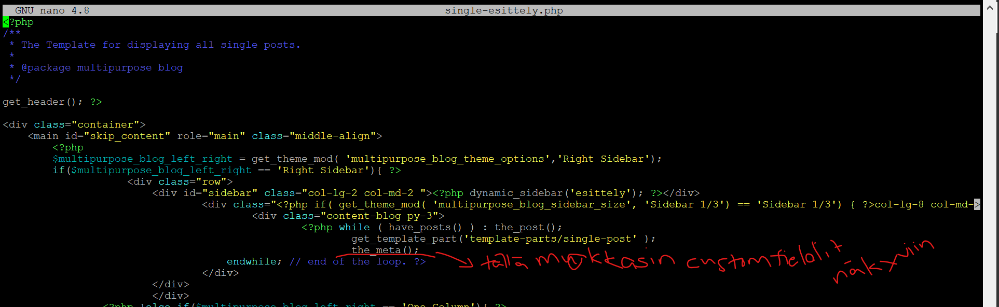
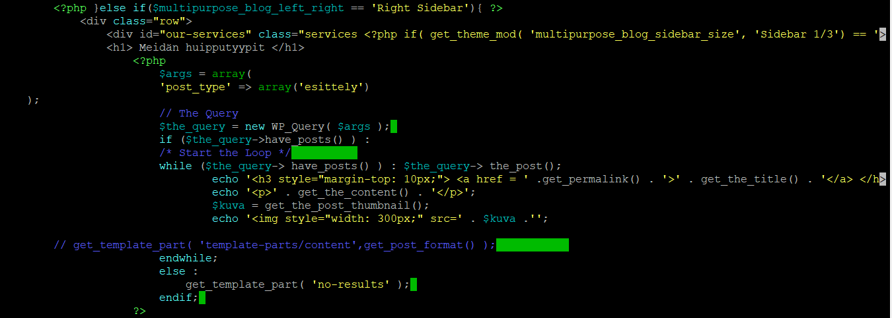
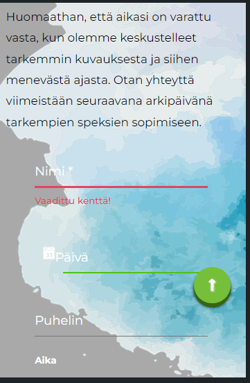

#Vapaamuotoinen päiväkirja projektista

## Suunnittelu 

Aloitin harkkatyön tekemisen valitsemalla sopivan teeman. Loin sivuston VLE-ympäristöön, mutta tarkoitus on tehdä varmuuskopiot paikalliselle koneelleni, josta siirrän ne githubiin. Sivuston aihe (halusin sivustolle myös woocommerce-verkkokaupan, mutta sen lisäksi blogimaisen tunnelman) rajasi sopivia teemoja aika paljon, joten lopulta teeman löytäminen pohjaksi oli suhteellisen helppoa ja nopeaa wp:n hakutoiminnalla. Alla olevasta kuvasta näkyy valitsemani teema: Multipurpose-Blog

Olin jo päättänyt jonkun aikaa sitten mitä sisältöä eli millaisen rakenteen haluan sivustolle luoda, joten menun luominen oli lopulta simppeli homma. Alunperin suunnittelin työstä yksinkertaisen, jota voisin monipuolistaa ajan riittäessä. En kuitenkaan halunnut haukata liian suurta palaa heti kerralla, joten koin helpommaksi aloittaa pienestä ja ajan riittäessä lisätä toiminnallisuuksia ja omia säätöjäni. Tähän minulla meni aikaan n. 3h ottaen huomioon brainstormauksen mitä olin tehnyt jo aiemmin kurssin aikana. 

## Day 1
Itse sivuston rakentamisen aloitin verkkokaupasta. 

Loin verkkokaupan tuotteet csv-generaattorilla. Sainpa samalla muistutella itselleni javascriptiä, kun generaattorilla pystyi luomaan myös fuktioilla arvoja muiden kenttien arvoista riippuen. Tämä helpotti suunnattomasti järkevän tuotekatalogin rakentamista. Tajusin vasta importtauksen jälkeen, että jouduin lisäämään kuvat manuaalisesti. Onneksi en halunnut verkkokauppaan kuin 20-30 tuotetta, joten manuaalinen näpertely ei ollut ihan kamalan työlästä. 

Tähän meni aikaa n. 3-4h, sillä sopivan csv-generaattorin etsiminen ja käytön opettelu vei aikaa. Sain kuitenkin tässä ajassa verkkokaupan tehtyä loppuun lukuunottamatta kategorioiden lisäämistä menuun.

## Day 2
Verkkokaupan kategoriat menuun, toiminnan testaus ja pieniä viilauksia, lopun sivuston hahmottelua. Eli uudet Pagesit Esittelylle, Gallerialle ja Yhteydenotolle. Samaan aikaan päivitin menua koko ajan. Sopivan lisäosan olin etsinut jo suunnitteluvaiheessa valokuvagallerialle. Valitsin gallerialle "Photo Gallery"-nimisen lisäosan, latausten määrän ja ilmaisen version ominaisuuksien perusteella. Pisimpään meni ehkä aikaa kuvien lataamisessa, sillä halusin helpottaa omaa naputteluani ja latasin omia kuviani sivuille. Näin ei tarvinnut miettiä käyttöoikeuksia sen kummemmin. Lisäosan kautta sain kaikki gallerian tarvitsemat asetukset asetettua suoraan käyttöliittymästä. Tähän meni aikaa n. 5h, josta suuri osa meni kuvien lataamiseen ja etsimiseen.

## Day 3
Muokkasin galleria-sivua sen verran, että otin sivun titlen pois käytöstä, sillä halusin cover-kuvan toimivan sivun otsikkona:

Tässä vaiheessa muistin tehdä lapsiteeman multipurpose-blog teemasta. Jouduin siis kopioimaan pari tiedostoa isäntäteeman kansiosta lapsikansioon. Onneksi vain 3!

Esittelysivusta tein Custom Postin, eli Esittely-sivun. Esittely-sivu on archive-muotoinen sivu, johon on kerätty kaikki hahmot Rumia-Studiolta. Custom Post on tehty sivustokohtainen pluginin avulla (jonka tein itse, tähän ei siis ole käytetty lisäosaa). Koodi löytyy harkkatyön alta githubista nimellä oma-plugin.php ja esittelyjen sivupohja löytyy nimellä single-esittely.php. Käytin single-esittelyssä hyödyksi single.php tiedostoa, jota muokkasin tarvittavan verran, jotta sain sidebarin puolen muutettua sekä sidebarin itsessään vaihdettua toiseksi ja haluamani lisätiedot näkyviin. Tätä ennen olin muuttanut functions.php-tiedostosta sidebar-2 nimen "esittely"ksi, jotta se olisi helppo tunnistaa sekä käyttiksestä että nimetä single-esittelyssä.

Custom Fieldseissä käytin tällä kertaa metatietoja, eli en käyttänyt tässäkään lisäosaa, vaan naputtelin haluamani custom fieldsit käyttöliittymäsä ja näytin ne the_meta() funktiolla single-esitys.php:ssä. 

Jouduin jonkun verran muuttamaan bootstrap-koodia, jotta sain sidebarista pienemmän ja itse postista isomman. Ongelmaksi muodostui se, että olisin halunnut kys. koodia lyhyemmäksi, koska mielestäni if-else rakennetta ei tuonne tarvita, koska sivua ei muokata enää erikseen käyttöliittymän kautta, mutta en löytänyt oikeaa pätkää, mitä voin poistaa ilman, että koko sivu menee rikki. Tähän siis tarttee kysyä open neuvoa. Tänään aikaa meni noin 6h. Suurin osa meni single-esittelykoodin muokkaamiseen, sillä se meni aikalailla yritä-erehdy-metodilla.

## Day 5
Esittelysivun archive-versio olisi ollut ihan nätti sellaisenaankin (eli archive.php:n asetuksilla), mutta halusin muokata siitä kuitenkin omanlaiseni, joten tein allaolevan koodin siihen. Periaatteessa ulkoasu ei ihan kamalasti muuttunut muuten kuin kuvat pienenivät ja grid-muotoilu(korttityyli) poistui.

Muokkasin myös single-esittely.php:tä niin, että sain postien välisen navigaation toimimaan ja näyttämään järkevältä:

Yhteydenottolomake toimii Forminator-lisäosan kautta, sillä saa lähetettyä viestin sekä laitettua ehdotuksen valokuvausajalle. Oletuksena form tuli vähän turhan lähelle teksti-kappaletta, niin muokkasin tekstin alamarginaalia, jotta sain siihen hiukan tilaa. Muutin myös lomakkeen css-koodia hieman (tein lomakkeesta kapeamman ja keskitin sen). Muokkasin oletus värit paremmin sopimaan teemaan (sinisestä vihreäksi korostukset). 

Päivitin kauppasivuja vielä sen verran, että sain sinne oman sidebarin, eli muokkasin woocommerce/templates/global/sidebar.php-tiedostoa niin, että vaihdoin sidebarin nimen "shop":sta "kauppa"an, jolloin sain käyttiksessä muokkaamani kauppa-sidebarin näkyviin vain kaupan sivuille (olin muuttanut tämänkin nimen functions.php-tiedostossa). Lisäsin käyttiksessä tuotteiden etsimiselle ja uusille tuotteille otsikot ja lisäsin niihin ylä-marginaalia hiukan ja muokkasin uusimpien tuotteiden näyttöasetuksia niin, että rivejä oli kolmen sijaan kaksi. Muuten sidebar meni oletusasetuksilla. 

Tänään aikaa meni eniten jälleen php-koodin rakentamiseen toimivaksi. Yhteensä aikaa meni n. 5h

## Day 6
Tänään muokkasin etusivun, eli vaihdoin etusivun käyttiksen asetuksista staattiseksi sivuksi ja muokkasin widgeteillä siitä haluamani näköisen: 
 1) Loin kotisivulle samankaltaisen cover-kuvan kuin galleriaankin.
 2) Loin sen alle palsta-blockin (3 palstaa)
 3) Jokainen palsta on yksi kategoria (eli cover, jonka overlaynä eri värit ja jonka otsikkona on kategorian nimi)
 4) Kategorian nimen alle loin buttonin, jota muokkasin outline-tyyliseksi ja keskitin sen.

 Lisäksi lisäsin footerin, eli muokkasin käyttiksen kautta teemaa niin, että footer osioita oli kolme ja jokaisessa oli yksi block: 1:ssä somenapit, toisessa teksti "Vieraile meidän somessa" ja kolmannessa kuvien copyright teksti. 
Lisäksi tein vielä pientä muotoilua esittely-single.php tiedostoon eli muutin sisällön keskitetyksi.
Lisäsin sivustolle myös taustakuvan tuomaan ilmettä lisää. 

Muokkasin myös "Blogi-sidebaria (sivuston "pääsidebar"), niin että sain siihenkin lisää ilmettä. Käytin viimeisimpien artikkeleiden listaukseen Cover-blockia ja etsi-blockiin käytin liukuväriä.

Testauksen aikana huomasin suuren kontrasti-ongelma lomakkeen ja taustan välillä, joten muutin css-koodin mediaquerylla alle 500px näytöille taustavärin tumman harmaaksi -> valkoinen ja musta teksti molemmat näkyy selkeämmin.  

Kontrastiasiat eivät ole ihan parasta mahdollista laatua sivustolla, mutta tein tämän kompromissin visuaalisuuden edellä. Kuitenkin kohderyhmänä on esteettisyydestä nauttivat henkilöt, jolloin voisi kuvitella, että heidän näkökykynsä on vähintään normaali.

Mielestäni sivusto on nyt valmis.

Tänään työskentelin n. 5h. Suurin aika päivästä meni widgettien kanssa, jotta sain visuaalisesti sellaisen, joka miellytti itseä.

## Day 7 
Raportin loppuunvienti